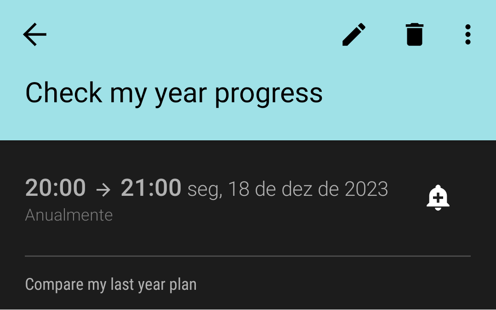

# Next Year Plan

> _"A goal without a plan is just a wish."_ 
> 
> Antoine de Saint-Exupéry

**My 2023 goal is to improve my employability, my altruism capability, and my life quality.**

For reaching this goal, in this year change I will start an experiment, I will put my self-development plan in this post and I will compare it at the end of the next year.

Reviewing this year, I checked that I made several self-improvements as advancing with my Ph.D., Modelling and thesis writing, starting this blog, improving my coding, and communications skills, connecting with a lot of interesting people, and so.

But, this post is about thinking in the future, considering:

- Thesis Development;
- Self-development courses;
- Content creation.

And the most important thing: 

# Thesis Development: 

### Qualification (Ph.D Mid-term defense):
- **Goal:** Present my Ph.D. Thesis Mid-Term Qualification.
- **Deadline:** May'2023.
- **Priority:** Extreme

### Publications
- **Goal:** I need to publish my research results in a Journal or Conference Proceedings.  
- **Deadline:** 2023
- **Priority:** Extreme

# Self-development courses:

Follow my currently courses enrolled courses plan for this year.

## Unicid - Universidade Cruzeiro do Sul 
### [Technologist in Systems Analysis and Development (Distance Learning)](https://www.cruzeirodosulvirtual.com.br/graduacao/analise-e-desenvolvimento-de-sistemas/)
- **Deadline:** Mar`2025
- **Status in Dec 2022:** Start in February/2023
- **Why?:** In 2017 I started a career change. Because my first BSc is not in the computational area, this course will improve my knowledge in this new field.
- **Priority:** High

## Coursera MOOCS

### [Applied Data Science with Python (Michigan) - 5 Courses Specialization ](https://www.coursera.org/specializations/data-science-python#courses)
- **Deadline:** 2023
- **Status in Dec 2022:** Started course 1 
- **Why?:** Improve my Data Science/Python Skils.
- **Priority:** Medium

### [Academic English: Writing Specialization (UCI) - 5 Courses Specialization ](https://www.coursera.org/specializations/academic-english)
- **Deadline:** 2023
- **Status in Dec 2022:** Conclude 2/5 courses 
- **Why?:** Improve my writing and communication skills.
- **Priority:** Medium

### [Good with Words: Speaking and Presenting (Michigan) - 4 Courses Specialization ](https://www.coursera.org/specializations/good-with-words-speaking-and-presenting)
- **Deadline:** 2023
- **Status in Dec 2022:** Conclude 1/4 courses 
- **Why?:** Improve my speaking and presentation communication skills.
- **Priority:** Medium

### [Model Thinking (Michigan)](https://www.coursera.org/learn/model-thinking)
- **Deadline:** Feb. 2023
- **Status in Dec 2022:** 56% 
- **Why?:** This course was help-me to improve my capacity to evaluate simulation models.
- **Priority:** High.

### [Introdução à Ciência da Computação com Python Parte 1 (USP)](https://www.coursera.org/learn/ciencia-computacao-python-conceitos)
- **Deadline:** Feb. 2023
- **Status in Dec 2022:** 29% 
- **Why?:** Improve my Computational/Python Skills.
- **Priority:** High.

## Estudar Na Prática MOOCS

### [CS50 - O Curso de Ciência da Computação de Havard](https://www.estudarfora.org.br/cursos/cc50/)
- **Deadline:** Jun. 2023
- **Status in Dec 2022:** 10% 
- **Why?:** Improve my computational skills (this curse is the Portuguese translation version of the Havard CS50 Course.
- **Priority:** Medium.

## Udemy MOOCS

### [100 Days of Code: The Complete Python Pro Bootcamp for 2023](https://www.udemy.com/course/100-days-of-code/)
- **Deadline:** 2023
- **Status in Dec 2022:** 11% 
- **Why?:** Improve my Computational/Python Skills.
- **Priority:** Medium.

### [Arquitetura de Redes](https://www.udemy.com/course/redes-modulo-1/)
- **Deadline:** 2023
- **Status in Dec 2022:** 5% 
- **Why?:** Improve my Computer Network Skills.
- **Priority:** Low.

### [Inglês: melhore sua pronúncia!](https://www.udemy.com/course/ingles-melhore-sua-pronuncia)
- **Deadline:** 2023
- **Status in Dec 2022:** 11% 
- **Why?:** Improve my English communication skills.
- **Priority:** Medium.

### [The Complete 2023 Web Development Bootcamp](https://www.udemy.com/course/the-complete-web-development-bootcamp/)
- **Deadline:** 2023
- **Status in Dec 2022:** 10% 
- **Why?:** Improve my Web Development Skills.
- **Priority:** Medium.

## Complexity Explorer MOOCS

### [Foundations & Applications of Humanities Analytics](https://www.complexityexplorer.org/courses/162-foundations-applications-of-humanities-analytics)
- **Deadline:** May 2023
- **Status in Dec 2022:** Start in January/2023 
- **Why?:** Study about computational text analysis skills.
- **Priority:** Low.

### [Introduction to Dynamical Systems and Chaos](https://www.complexityexplorer.org/courses/145-introduction-to-dynamical-systems-and-chaos)
- **Deadline:** 2023
- **Status in Dec 2022:** 5% 
- **Why?:** Improve my simulations results analysis skills.
- **Priority:** Medium.

# Content creation:

- Create new content using this website as media publication.
    - Write one or two posts per mount. In the First 2023' months, I will focus on my thesis writing.
- I want to start a video channel about my research and programming content.

Besides this plan describe above, I will follow to improve in theses topics also:
- Open Science;
- Design of experiments;
- Agent-Based Simulations (ABS) modelling knowledge;
- ABS validation & verification procedures;
- Academic writing improvements;
- Coding improvements;
- ABS implementation in Python; 
- Presentations Skills. 

And you, already thinking about your next year's resolutions? [Let me know!](https://twitter.com/lgrando123/status/1604612810247397376) 