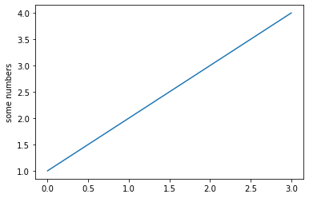

```python
extensions = ['sphinxcontrib.bibtex']
bibtex_bibfiles = ['refs.bib']
```

[Mesa](https://github.com/projectmesa/mesa) is an [agent-based modeling](https://en.wikipedia.org/wiki/Agent-based_model) [Python](https://www.python.org/) framework. I am an long time [Netlogo](https://ccl.northwestern.edu/netlogo/) user. Personally I like a lot Netlogo, they are very easy to implement a model, but I want to try Mesa. For that, I will replicate their [introductory tutorial](https://mesa.readthedocs.io/en/latest/tutorials/intro_tutorial.html). I strong recommend that you read the Mesa docs, but, feel free to follow this tutorial. 


The introductury tutorial modelling one simulated agent-based economy model about the wealth distribution. 


```python
import matplotlib.pyplot as plt

import math
```


```python
x=3
y = x-4
print(y)
```

    -1


```python
plt.plot([1, 2, 3, 4])
plt.ylabel('some numbers')
plt.show()
```


    

    

